# Взаимосвязь экономического роста, безработицы, инфляции и процентной ставки в США

## 1. Введение

В работе проверяется связь между ростом экономики США и изменением безработицы. Основная идея связана с законом Оукена: если реальный ВВП растёт быстрее, безработица обычно снижается или растёт медленнее. Если рост ВВП замедляется, безработица, наоборот, чаще увеличивается.

В модель также добавлены инфляция и ставка федеральных фондов. Эти показатели важны, потому что рост цен и процентная политика могут влиять на спрос в экономике, а значит и на рынок труда.

Научная основа работы — статья Knotek, E. S. II (2007). *How useful is Okun's law?* Economic Review, Federal Reserve Bank of Kansas City, 92(Q IV), 73-103. В статье показано, что отрицательная связь между ростом ВВП и изменением безработицы действительно существует и может быть полезна для анализа. При этом эта связь не является точным экономическим законом: она может меняться во времени и зависеть от состояния экономики.

Проблема исследования состоит в том, чтобы проверить, насколько устойчиво рост ВВП связан с изменением безработицы после кризиса 2008–2009 гг., COVID-шока и периода высокой инфляции и роста ставок в 2021–2024 гг. Основная гипотеза: более высокий темп роста реального ВВП связан со снижением прироста безработицы. При этом инфляция и ставка федеральных фондов могут добавлять дополнительную информацию, но сама связь может меняться из-за крупных экономических шоков.

## 2. Исходные данные

| Показатель                            | Единицы                                       | Частота в источнике             | Источник                      | Ссылка                                      |
| ------------------------------------- | --------------------------------------------- | ------------------------------- | ----------------------------- | ------------------------------------------- |
| Реальный ВВП США                      | млрд цепных долларов 2017 г., SAAR            | квартальная                     | BEA через FRED                | https://fred.stlouisfed.org/series/GDPC1    |
| Уровень безработицы                   | % рабочей силы, сезонно скорректировано       | месячная, усреднена до квартала | BLS через FRED                | https://fred.stlouisfed.org/series/UNRATE   |
| Индекс потребительских цен CPI-U      | индекс 1982-1984=100, сезонно скорректировано | месячная, усреднена до квартала | BLS через FRED                | https://fred.stlouisfed.org/series/CPIAUCSL |
| Эффективная ставка федеральных фондов | % годовых, среднее за месяц                   | месячная, усреднена до квартала | Board of Governors через FRED | https://fred.stlouisfed.org/series/FEDFUNDS |

| Параметр                         | Значение        |
| -------------------------------- | --------------- |
| Страна                           | США             |
| Период уровней                   | 1990Q1 - 2026Q1 |
| Наблюдений уровней               | 145             |
| Период преобразованных рядов     | 1990Q2 - 2026Q1 |
| Наблюдений преобразованных рядов | 144             |
| Дата выгрузки                    | 2026-05-31      |

Исходные месячные ряды UNRATE, CPIAUCSL и FEDFUNDS были переведены в квартальные данные через среднее значение за квартал. Ряд GDPC1 уже публикуется как квартальный. Основной файл данных сохранён: `data/fred_quarterly_us_macro_1990_2026.csv`. Файл с преобразованными рядами сохранён: `data/fred_transformed_stationary_series.csv`.

Для моделирования использованы преобразования:

$$g_t = 400\Delta\ln(GDPC1_t),\quad \Delta u_t = u_t-u_{t-1},\quad \pi_t = 400\Delta\ln(CPI_t),\quad \Delta i_t=i_t-i_{t-1}.$$

Здесь (g_t) — темп роста ВВП, (\Delta u_t) — прирост безработицы, (\pi_t) — инфляция CPI, (\Delta i_t) — прирост ставки федеральных фондов.

Темпы роста ВВП и инфляции умножены на 400, чтобы получить годовые темпы на основе квартальных данных. На последнем наблюдении 2026Q1: ВВП = 24 152.656 млрд долл., безработица = 4.333%, CPI = 328.114, ставка Fed funds = 3.640%.

## 3. Описание динамики

| Показатель       | N       | Среднее    | Дисперсия      | Ст. откл. | Минимум   | Максимум   |
| ---------------- | ------- | ---------- | -------------- | --------- | --------- | ---------- |
| Реальный ВВП     | 145.000 | 16 428.079 | 15 955 099.329 | 3 994.383 | 9 951.916 | 24 152.656 |
| Безработица      | 145.000 | 5.665      | 2.999          | 1.732     | 3.533     | 13.000     |
| CPI              | 145.000 | 211.075    | 2 768.727      | 52.619    | 128.033   | 328.114    |
| Ставка Fed funds | 145.000 | 2.885      | 5.463          | 2.337     | 0.060     | 8.250      |

| Показатель              | N       | Среднее | Дисперсия | Ст. откл. | Минимум | Максимум |
| ----------------------- | ------- | ------- | --------- | --------- | ------- | -------- |
| g, рост ВВП             | 144.000 | 2.436   | 19.546    | 4.421     | -32.817 | 29.903   |
| Δu, прирост безработицы | 144.000 | -0.007  | 0.821     | 0.906     | -4.200  | 9.167    |
| π, инфляция CPI         | 144.000 | 2.614   | 4.598     | 2.144     | -9.267  | 9.297    |
| Δi, прирост ставки      | 144.000 | -0.032  | 0.200     | 0.448     | -1.433  | 1.463    |

На графиках исходных рядов видно, что реальный ВВП и CPI имеют выраженный рост во времени. Это ожидаемо: экономика в долгосрочном периоде растёт, а общий уровень цен постепенно повышается. Безработица ведёт себя иначе: она резко увеличивается во время кризисов, особенно в 2008–2009 гг. и в 2020 г. Ставка федеральных фондов также менялась по периодам: после 2008 г. она долго была низкой, а после 2022 г. заметно выросла.

Сезонность в данных в основном уже устранена самими источниками: ВВП, CPI и безработица публикуются с сезонной корректировкой, а ставка FEDFUNDS усреднена по кварталам.

На преобразованных рядах лучше видны резкие изменения. Особенно выделяется 2020Q2: рост ВВП составил -32.817% годовых, а прирост безработицы — 9.167 п.п. Корреляция между квартальным ростом ВВП и приростом безработицы равна -0.860. Если убрать 2020Q2–2020Q3, корреляция становится -0.485. То есть связь остаётся отрицательной, но становится заметно слабее.

Это означает, что COVID-период сильно усиливает видимую связь между ВВП и безработицей. Поэтому результаты не стоит понимать как постоянную и точную зависимость. Скорее это эмпирическая связь, которая хорошо видна в данных, но может усиливаться или ослабевать в кризисные периоды.

Коррелограммы показывают, что инфляция и процентная ставка имеют некоторую инерцию: их текущие значения связаны с прошлыми. Прирост безработицы имеет слабую краткосрочную автокорреляцию, но содержит резкие кризисные выбросы. Поэтому для анализа подходят модели с лагами, в частности ADL и VAR.

| Ряд                     | ACF(1) | ACF(4) | ACF(8) | PACF(1) | PACF(4) | PACF(8) |
| ----------------------- | ------ | ------ | ------ | ------- | ------- | ------- |
| g, рост ВВП             | -0.133 | -0.020 | 0.047  | -0.133  | -0.019  | 0.049   |
| Δu, прирост безработицы | -0.157 | 0.030  | -0.027 | -0.157  | 0.022   | -0.048  |
| π, инфляция CPI         | 0.404  | 0.061  | -0.035 | 0.404   | -0.060  | -0.068  |
| Δi, прирост ставки      | 0.697  | 0.157  | -0.179 | 0.697   | -0.172  | -0.095  |

Последние 10 наблюдений преобразованных рядов:

| quarter | g, рост ВВП | Δu, прирост безработицы | π, инфляция CPI | Δi, прирост ставки |
| ------- | ----------- | ----------------------- | --------------- | ------------------ |
| 2023Q4  | 3.362       | 0.167                   | 2.873           | 0.070              |
| 2024Q1  | 0.839       | 0.033                   | 3.628           | 0.000              |
| 2024Q2  | 3.526       | 0.133                   | 2.663           | 0.000              |
| 2024Q3  | 3.286       | 0.200                   | 1.327           | -0.067             |
| 2024Q4  | 1.835       | -0.033                  | 3.129           | -0.613             |
| 2025Q1  | -0.651      | 0.000                   | 3.632           | -0.320             |
| 2025Q2  | 3.766       | 0.067                   | 1.638           | 0.000              |
| 2025Q3  | 4.282       | 0.133                   | 3.043           | -0.037             |
| 2025Q4  | 0.481       | 0.117                   | 2.851           | -0.397             |
| 2026Q1  | 1.608       | -0.117                  | 3.141           | -0.257             |

## 4. Стационарность

Перед построением моделей нужно проверить, можно ли использовать ряды в исходном виде. Если ряд имеет сильный тренд, модель может показать ложную связь. Поэтому сначала проверяется стационарность.

ADF-тест проверяет, есть ли у ряда единичный корень, то есть является ли ряд нестационарным. KPSS-тест используется как дополнительная проверка: он, наоборот, проверяет гипотезу стационарности. Для уровней в ADF/KPSS включался тренд, для преобразованных рядов — константа.

| Показатель              | Преобразование       | ADF stat | ADF p  | KPSS stat | KPSS p | Вывод           |
| ----------------------- | -------------------- | -------- | ------ | --------- | ------ | --------------- |
| ln(реального ВВП)       | уровень              | -1.673   | 0.762  | 0.297     | 0.010  | нестационарен   |
| безработица             | уровень              | -3.276   | 0.070  | 0.142     | 0.057  | смешанный вывод |
| ln(CPI)                 | уровень              | -1.767   | 0.720  | 0.139     | 0.063  | смешанный вывод |
| ставка Fed funds        | уровень              | -3.437   | 0.047  | 0.203     | 0.015  | смешанный вывод |
| g, рост ВВП             | первая разность/темп | -13.574  | <0.001 | 0.138     | 0.100  | стационарен     |
| Δu, прирост безработицы | первая разность/темп | -13.912  | <0.001 | 0.047     | 0.100  | стационарен     |
| π, инфляция CPI         | первая разность/темп | -7.745   | <0.001 | 0.145     | 0.100  | стационарен     |
| Δi, прирост ставки      | первая разность/темп | -4.998   | <0.001 | 0.135     | 0.100  | стационарен     |

Вывод: уровни ВВП и CPI лучше не использовать в VAR без преобразования, потому что в них есть долгосрочный рост. Поэтому ВВП используется как темп роста, а CPI — как инфляция. Безработица и ставка дают более неоднозначные результаты, так как они зависят от экономических режимов и не могут расти бесконечно. Поэтому в основной модели используются их приросты.

После преобразований ряды становятся более подходящими для моделирования. Поэтому дальнейший анализ проводится в темпах роста и приростах. При этом результаты нужно интерпретировать с учётом крупных кризисных выбросов, особенно 2008–2009 гг. и 2020 г.

## 5. Наличие взаимосвязей

### 5.1. Коинтеграционная матрица

Коинтеграция нужна для проверки долгосрочной связи между рядами. Если несколько рядов по отдельности имеют тренд, но между ними есть устойчивая долгосрочная связь, это может быть признаком коинтеграции.

Тест Энгла–Грейнджера проверяет долгосрочную связь между двумя рядами. Тест Йохансена используется для системы из нескольких рядов. В этой работе результаты коинтеграции используются только как дополнительная проверка, а не как основа всей модели.

Причина в том, что не все ряды одинаково уверенно являются нестационарными. Для части показателей тесты дают смешанные результаты. Поэтому делать VECM основной моделью было бы не совсем надёжно.

Матрица ниже содержит `p-value; вывод на 5%`. Матрица Энгла–Грейнджера не обязана быть симметричной, потому что результат зависит от того, какая переменная выбрана зависимой на первом шаге. Поэтому пары с p-value ниже 5% рассматриваются только как возможные признаки долгосрочной связи, а не как окончательное доказательство.

| Показатель        | ln(реального ВВП) | безработица | ln(CPI)     | ставка Fed funds |
| ----------------- | ----------------- | ----------- | ----------- | ---------------- |
| ln(реального ВВП) | -                 | 0.852; нет  | 0.767; нет  | 0.822; нет       |
| безработица       | 0.055; нет        | -           | 0.054; нет  | 0.030; есть      |
| ln(CPI)           | 0.805; нет        | 0.935; нет  | -           | 0.887; нет       |
| ставка Fed funds  | 0.017; есть       | 0.224; нет  | 0.019; есть | -                |

Тест Йохансена, trace statistic, число лагов разностей = 1:

| H0: rank <= | trace stat | crit 90% | crit 95% | crit 99% | reject 5% |
| ----------- | ---------- | -------- | -------- | -------- | --------- |
| 0           | 51.056     | 44.493   | 47.855   | 54.681   | да        |
| 1           | 20.293     | 27.067   | 29.796   | 35.463   | нет       |
| 2           | 4.369      | 13.429   | 15.494   | 19.935   | нет       |
| 3           | 0.109      | 2.705    | 3.841    | 6.635    | нет       |

На 5% тест Йохансена показывает один возможный долгосрочный вектор связи. Но из-за неоднозначных результатов по стационарности безработицы и ставки основной моделью выбрана VAR на преобразованных рядах. ECM/VECM не используется как основная модель; ниже приведена диагностическая VECM/ECM-проверка, чтобы явно показать ограничение этого подхода для текущих данных.

### 5.2. Причинность по Грейнджеру

В таблице строка — предполагаемая причина, столбец — следствие; значения — p-value F-теста в выбранной VAR.

| Причина                 | g, рост ВВП | Δu, прирост безработицы | π, инфляция CPI | Δi, прирост ставки |
| ----------------------- | ----------- | ----------------------- | --------------- | ------------------ |
| g, рост ВВП             |             | 0.000                   | 0.176           | 0.313              |
| Δu, прирост безработицы | 0.000       |                         | 0.064           | 0.098              |
| π, инфляция CPI         | 0.658       | 0.532                   |                 | 0.270              |
| Δi, прирост ставки      | 0.052       | 0.134                   | 0.749           |                    |

Наиболее сильные связи по p-value:

| Причина                 | Следствие               | p-value |
| ----------------------- | ----------------------- | ------- |
| Δu, прирост безработицы | g, рост ВВП             | <0.001  |
| g, рост ВВП             | Δu, прирост безработицы | <0.001  |
| Δi, прирост ставки      | g, рост ВВП             | 0.052   |
| Δu, прирост безработицы | π, инфляция CPI         | 0.064   |
| Δu, прирост безработицы | Δi, прирост ставки      | 0.098   |
| Δi, прирост ставки      | Δu, прирост безработицы | 0.134   |

На 5% уровне значимости обнаружена двусторонняя связь между ростом ВВП и приростом безработицы: g ⇄ Δu. Это означает, что прошлые значения роста ВВП помогают объяснять будущий прирост безработицы, а прошлые значения прироста безработицы помогают объяснять будущий рост ВВП.

Такой результат хорошо согласуется с экономической логикой. Рост ВВП влияет на рынок труда, а состояние рынка труда, в свою очередь, связано с дальнейшей динамикой выпуска. Поэтому простая статическая регрессия закона Оукена недостаточна: нужно учитывать динамику и лаги.

### 5.3. Диагностическая VECM/ECM-проверка

Так как тест Йохансена показывает один возможный коинтеграционный вектор, дополнительно оценена VECM как ECM-представление системы уровней. Эта модель не выбрана основной из-за смешанных выводов о порядке интегрируемости безработицы и ставки, но она закрывает проверку коинтеграционного ECM-подхода и показывает, насколько быстро переменные реагируют на отклонение от долгосрочного соотношения.

Сводка VECM:

| Показатель     | Значение                         |
| -------------- | -------------------------------- |
| Модель         | VECM как ECM-представление       |
| Переменные     | ln_gdp, unrate, ln_cpi, fedfunds |
| k_ar_diff      | 1.000                            |
| coint_rank     | 1.000                            |
| deterministic  | co                               |
| log-likelihood | 939.837                          |
| nobs           | 143.000                          |

Коэффициенты корректировки `alpha` и коинтеграционный вектор `beta`:

| variable | alpha_adjustment | beta_cointegration |
| -------- | ---------------- | ------------------ |
| ln_gdp   | -0.007           | 1.000              |
| unrate   | 1.330            | 0.029              |
| ln_cpi   | 0.008            | -0.847             |
| fedfunds | -2.018           | 0.041              |

Также оценено одно ECM-уравнение для прироста безработицы:

$$\Delta u_t = c + \lambda ECT_{t-1} + \Gamma_1\Delta y_{t-1} + \varepsilon_t,$$

где `ECT` построен на основе оцененного коинтеграционного вектора VECM.

| Параметр      | coef    | std err HAC | t      | p-value |
| ------------- | ------- | ----------- | ------ | ------- |
| const         | -6.824  | 3.818       | -1.787 | 0.074   |
| ECT_L1        | 1.330   | 0.681       | 1.954  | 0.051   |
| d_ln_gdp_L1   | -60.611 | 35.771      | -1.694 | 0.090   |
| d_unrate_L1   | -0.868  | 0.471       | -1.842 | 0.065   |
| d_ln_cpi_L1   | -10.982 | 8.383       | -1.310 | 0.190   |
| d_fedfunds_L1 | -0.246  | 0.108       | -2.272 | 0.023   |

Файлы расчетов сохранены в `tables/vecm_diagnostic_summary.csv`, `tables/vecm_alpha_beta.csv` и `tables/ecm_unrate_equation.csv`. Вывод: ECM/VECM дает диагностически полезное представление долгосрочной связи, но для интерпретации основной динамики в работе надежнее использовать ADL и VAR на стационарных преобразованиях.

## 6. Спецификации моделей

В работе оценены две группы моделей: ADL и VAR.

ADL-модель используется для проверки закона Оукена в более простой форме. В ней прирост безработицы объясняется текущим и прошлыми значениями роста ВВП, а также прошлым значением самой безработицы. Дополнительно добавлена фиктивная переменная для 2020Q2, чтобы учесть резкий COVID-шок.

ADL-модель для закона Оукена:

$$\Delta u_t = \alpha + \sum_{j=0}^q \beta_j g_{t-j} + \sum_{k=1}^p \phi_k \Delta u_{t-k} + \delta D_{2020Q2} + \varepsilon_t.$$

VAR-модель используется для анализа всех переменных вместе. Она учитывает, что рост ВВП, безработица, инфляция и ставка могут быть связаны друг с другом через прошлые значения.

VAR-модель для системы стационарных рядов:

$$y_t = c + A_1y_{t-1} + \dots + A_py_{t-p} + e_t,$$

где $y_t=(g_t,\Delta u_t,\pi_t,\Delta i_t)'$.

У этих моделей есть ограничения. ADL проще интерпретировать, но она описывает только одно основное уравнение. VAR даёт более общий анализ взаимосвязей, но её результаты зависят от выбора числа лагов и порядка переменных при построении шоков. ECM/VECM не используется как основная модель, потому что для этого нужна более уверенная коинтеграционная структура. При этом диагностическая VECM/ECM-проверка оценена отдельно и используется как проверка устойчивости, а не как базовая спецификация.

## 7. Моделирование

Сравнение ADL-спецификаций:

| Спецификация                        | N   | Adj.R2 | RMSE  | AIC     | BIC     | Ljung-Box p | Jarque-Bera p | Выбрана для интерпретации |
| ----------------------------------- | --- | ------ | ----- | ------- | ------- | ----------- | ------------- | ------------------------- |
| ADL-1: $\Delta u_t = c + \beta g_t$              | 144 | 0.738  | 0.460 | 189.306 | 195.246 | 0.106       | <0.001        |                           |
| ADL-2: $g_t,\ g_{t-1},\ g_{t-2},\ \Delta u_{t-1}$ | 142 | 0.764  | 0.435 | 176.435 | 191.214 | 0.693       | <0.001        |                           |
| ADL-3: ADL-2 + $D_{2020Q2}$              | 142 | 0.880  | 0.310 | 82.073  | 99.808  | <0.001      | <0.001        | да                        |

Коэффициенты выбранной ADL:

| Параметр      | coef   | std err HAC | t      | p-value |
| ------------- | ------ | ----------- | ------ | ------- |
| const         | 0.249  | 0.079       | 3.165  | 0.002   |
| gdp_growth    | -0.106 | 0.021       | -4.987 | <0.001  |
| gdp_growth_L1 | -0.024 | 0.013       | -1.843 | 0.065   |
| gdp_growth_L2 | 0.010  | 0.014       | 0.716  | 0.474   |
| d_unrate_L1   | -0.086 | 0.075       | -1.154 | 0.248   |
| D_2020Q2      | 5.287  | 0.781       | 6.768  | <0.001  |

Сначала были оценены три ADL-модели. ADL-1 — самая простая модель, где прирост безработицы зависит только от текущего роста ВВП. ADL-2 добавляет лаги роста ВВП и лаг прироста безработицы. ADL-3 дополнительно учитывает COVID-шок через переменную D2020Q2.

По значениям Adj.R2, RMSE, AIC и BIC лучше всего выглядит ADL-3. Она заметно лучше описывает данные, потому что отдельно учитывает резкий скачок безработицы в 2020Q2. Поэтому именно ADL-3 выбрана для интерпретации коэффициента Оукена.

При этом модель не идеальна: тест Ljung–Box показывает автокорреляцию остатков. Поэтому результаты ADL-3 нужно использовать осторожно. Для стандартных ошибок применяются HAC-ошибки, которые лучше подходят при возможной автокорреляции и неодинаковой дисперсии ошибок.

Краткосрочный коэффициент Оукена при текущем росте ВВП равен -0.106. Это означает, что увеличение квартального годового темпа роста ВВП на 1 п.п. связано со снижением прироста безработицы примерно на 0.106 п.п. в том же квартале при прочих равных.

Например, если квартальный годовой темп роста ВВП выше на 2 п.п., то текущий прирост безработицы в среднем ниже примерно на 0.213 п.п. Динамический суммарный эффект с учётом лагов равен -0.111 п.п.

Сравнение VAR-спецификаций:

| Спецификация        | Устойчива | AIC    | BIC   | HQIC  | Portmanteau p | Normality p | Выбрана по AIC |
| ------------------- | --------- | ------ | ----- | ----- | ------------- | ----------- | -------------- |
| VAR(1), const       | да        | -0.035 | 0.379 | 0.133 | 0.629         | <0.001      | да             |
| VAR(2), const       | да        | 0.047  | 0.796 | 0.351 | 0.553         | <0.001      |                |
| VAR(1), const+trend | да        | -0.019 | 0.479 | 0.183 | 0.685         | <0.001      |                |

Уравнение прироста безработицы в выбранной VAR:

| Параметр      | coef Δu equation |
| ------------- | ---------------- |
| const         | 0.387            |
| L1.gdp_growth | -0.143           |
| L1.d_unrate   | -0.816           |
| L1.inflation  | -0.022           |
| L1.d_fedfunds | -0.253           |

Итоговая таблица спецификаций:

| Спецификация модели                 | Стационарность модели        | Ошибка модели, инф.критерии          | Анализ остатков                         | Выбор модели |
| ----------------------------------- | ---------------------------- | ------------------------------------ | --------------------------------------- | ------------ |
| ADL-1: $\Delta u_t = c + \beta g_t$              | стационарные переменные; OLS | RMSE=0.460; AIC=189.306; BIC=195.246 | Ljung-Box p=0.106; JB p=<0.001          |              |
| ADL-2: $g_t,\ g_{t-1},\ g_{t-2},\ \Delta u_{t-1}$ | стационарные переменные; OLS | RMSE=0.435; AIC=176.435; BIC=191.214 | Ljung-Box p=0.693; JB p=<0.001          |              |
| ADL-3: ADL-2 + $D_{2020Q2}$              | стационарные переменные; OLS | RMSE=0.310; AIC=82.073; BIC=99.808   | Ljung-Box p=<0.001; JB p=<0.001         | да           |
| VAR(1), const                       | устойчива: да                | AIC=-0.035; BIC=0.379; HQIC=0.133    | Portmanteau p=0.629; Normality p=<0.001 | да           |
| VAR(2), const                       | устойчива: да                | AIC=0.047; BIC=0.796; HQIC=0.351     | Portmanteau p=0.553; Normality p=<0.001 |              |
| VAR(1), const+trend                 | устойчива: да                | AIC=-0.019; BIC=0.479; HQIC=0.183    | Portmanteau p=0.685; Normality p=<0.001 |              |

Для VAR выбрана модель VAR(1) с константой. Она устойчива и имеет минимальный AIC среди рассмотренных вариантов. Это означает, что среди выбранных моделей она лучше всего подходит по информационному критерию AIC.

Диагностика показывает, что у VAR нет серьёзной автокорреляции остатков по Portmanteau-тесту. Однако нормальность остатков нарушается. Это ожидаемо для таких данных, потому что в выборке есть сильные кризисные выбросы, особенно в 2020 г.

В базовую VAR не добавлялись фиктивные переменные, чтобы сохранить модель простой и сопоставимой. Однако для более строгой проверки можно было бы отдельно оценить VAR с COVID-фиктивными переменными или проверить результаты без 2020Q2–2020Q3.

## 8. Интерпретация

IRF показывает, как прирост безработицы реагирует на неожиданные изменения других переменных в VAR. FEVD показывает, какие переменные сильнее всего объясняют ошибку прогноза прироста безработицы.

IRF и FEVD построены для ортогональных шоков, поэтому результат зависит от порядка переменных в VAR. В данной работе использован порядок: g, Δu, π, Δi.

В выбранном порядке положительный шок роста ВВП сразу снижает прирост безработицы, после чего эффект быстро становится слабее. Суммарный отклик за 12 кварталов равен -0.690 п.п. Это согласуется с законом Оукена: более высокий рост ВВП связан с улучшением ситуации на рынке труда.

Разложение дисперсии ошибки прогноза для Δu:

| Горизонт | g, рост ВВП | Δu, прирост безработицы | π, инфляция CPI | Δi, прирост ставки |
| -------- | ----------- | ----------------------- | --------------- | ------------------ |
| 4.000    | 0.608       | 0.376                   | 0.005           | 0.012              |
| 8.000    | 0.607       | 0.375                   | 0.005           | 0.013              |
| 12.000   | 0.607       | 0.375                   | 0.005           | 0.013              |

По FEVD видно, что основную часть ошибки прогноза прироста безработицы объясняют шоки роста ВВП и собственные шоки безработицы. Вклад инфляции и процентной ставки небольшой.

Практически это означает, что в данной модели для прогноза рынка труда важнее всего учитывать состояние выпуска и прошлую динамику самой безработицы. Инфляция и изменение ставки играют меньшую роль.

## 9. Заключение

Гипотеза об отрицательной связи между ростом реального ВВП и изменением безработицы в целом подтверждается. Корреляция между ростом ВВП и приростом безработицы отрицательная. Коэффициенты ADL-модели также имеют ожидаемый знак. VAR-модель показывает, что положительный шок роста ВВП снижает прирост безработицы.

При этом связь нельзя считать постоянной и механической. Результаты сильно зависят от кризисных наблюдений, особенно от COVID-периода 2020Q2–2020Q3. Если убрать эти наблюдения, связь между ростом ВВП и приростом безработицы остаётся отрицательной, но становится слабее.

ADL-модель с фиктивной переменной 2020Q2 лучше описывает данные по RMSE и информационным критериям. Однако диагностика остатков показывает автокорреляцию, поэтому коэффициенты этой модели нужно трактовать осторожно. Они используются как эмпирическая оценка краткосрочной связи, а не как точный постоянный параметр.

VAR-модель на преобразованных рядах показывает двустороннюю связь по Грейнджеру между ростом ВВП и приростом безработицы. Это означает, что прошлые значения роста ВВП помогают объяснять будущую динамику безработицы, а прошлые изменения безработицы помогают объяснять будущий рост ВВП.

IRF и FEVD показывают, что в выбранной VAR основную роль в объяснении ошибки прогноза прироста безработицы играют шоки выпуска. Вклад инфляции и изменения ставки федеральных фондов оказался небольшим.

В целом результаты согласуются с выводами Knotek (2007): закон Оукена остаётся полезным эмпирическим правилом для анализа рынка труда, но его параметры зависят от периода, кризисных шоков и выбранной модели.

## 10. Микроквалификация: Кластеризация стран на основе динамики макроэкономических временных рядов

### 10.1. Данные и постановка

Дополнительное задание выполнено в роли аналитика международной экономической организации. Цель — выделить группы стран, похожих не по абсолютному уровню показателей, а по форме динамики ключевых макроэкономических рядов. Это полезно для оценки того, какие страны могут сходным образом реагировать на внешние шоки.

Использованы международные аналоги показателей из разделов 1–8: рост реального ВВП, безработица, инфляция CPI и реальная процентная ставка. Данные взяты из World Bank DataBank за 2010–2023; после проверки полноты оставлено 22 стран.

| Показатель                 | World Bank code   | Единицы              | Ссылка                                                 |
| -------------------------- | ----------------- | -------------------- | ------------------------------------------------------ |
| Рост реального ВВП         | NY.GDP.MKTP.KD.ZG | % к предыдущему году | https://data.worldbank.org/indicator/NY.GDP.MKTP.KD.ZG |
| Безработица                | SL.UEM.TOTL.ZS    | % рабочей силы       | https://data.worldbank.org/indicator/SL.UEM.TOTL.ZS    |
| Инфляция CPI               | FP.CPI.TOTL.ZG    | % к предыдущему году | https://data.worldbank.org/indicator/FP.CPI.TOTL.ZG    |
| Реальная процентная ставка | FR.INR.RINR       | %                    | https://data.worldbank.org/indicator/FR.INR.RINR       |

Файл панели данных: `microqualification/data/world_bank_macro_panel.csv`.

### 10.2. Краткий описательный анализ временных рядов

Ряды имеют годовую частоту, поэтому сезонность не анализируется. Для большинства стран рост ВВП и инфляция уже представлены как темпы изменения, то есть ближе к стационарным динамическим показателям. Безработица и реальная ставка используются в уровнях для кластеризации траекторий, а для модельного анализа представителя дополнительно берутся первые разности. Кризисные эпизоды 2020–2022 гг. создают структурные выбросы: падение выпуска в 2020 г., последующее восстановление, инфляционный шок и изменение реальных ставок.

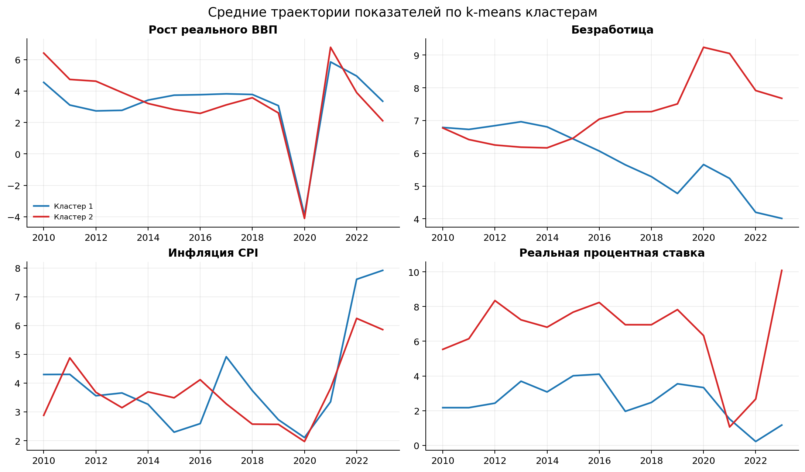

### 10.3. Матрицы расстояний

Построены три подхода к расстояниям между странами.

1. Евклидово расстояние по стандартизованным динамикам: для каждой страны каждый показатель стандартизуется по времени, после чего все траектории объединяются в один вектор. Этот подход сравнивает форму динамики и снижает влияние абсолютных уровней.
2. Correlation distance: `1 - corr` между объединенными динамическими векторами. Подход еще сильнее фокусируется на синхронности и форме траекторий.
3. Summary-distance: евклидово расстояние по признакам `mean/std/slope/min/max` для каждого показателя. Это компактная проверка устойчивости, основанная не на каждой точке ряда, а на характеристиках динамики.

Основная матрица расстояний сохранена: `microqualification/tables/distance_matrix_dynamic_euclidean.csv`.

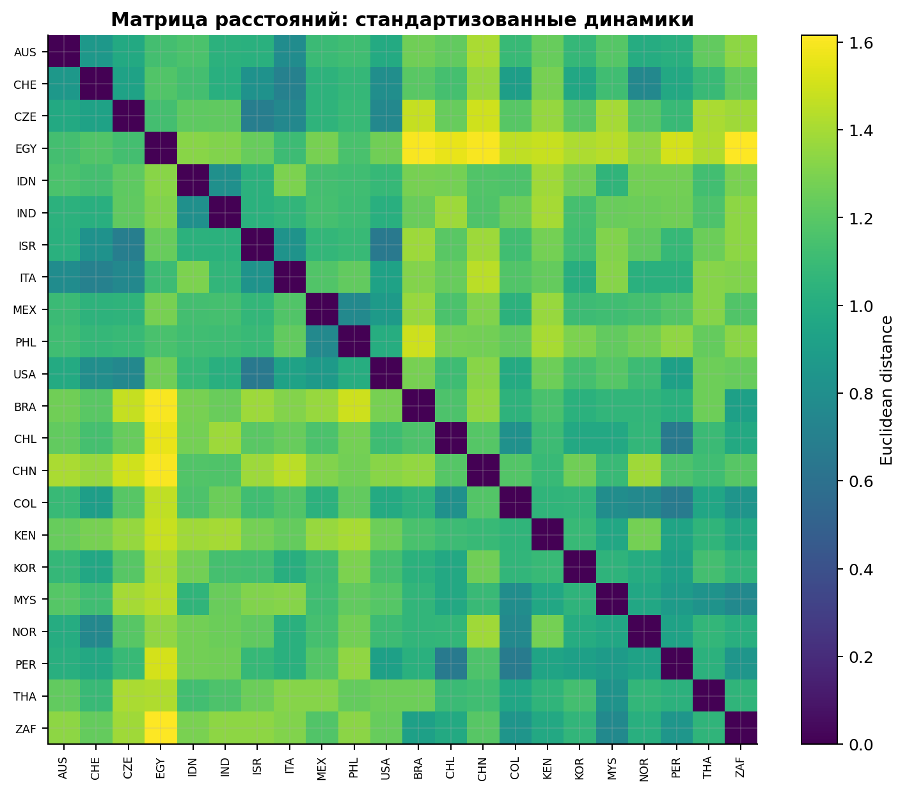

### 10.4. Кластеризация: k-means и иерархический подход

Число кластеров выбрано по silhouette для k-means на стандартизованных динамиках. Затем это же число кластеров использовано для иерархической кластеризации, чтобы результаты были сопоставимы.

| Метод                       | Матрица расстояний / признаки                       | k     | Silhouette | Комментарий                                                                  | Преимущество                                                     | Ограничение                                              | Файл матрицы                          |
| --------------------------- | --------------------------------------------------- | ----- | ---------- | ---------------------------------------------------------------------------- | ---------------------------------------------------------------- | -------------------------------------------------------- | ------------------------------------- |
| k-means                     | евклидово расстояние по стандартизованным динамикам | 2.000 | 0.173      | Группирует страны по общей форме динамики всех рядов                         | центроиды позволяют выбрать типичного представителя кластера     | предполагает компактные почти сферические группы         | distance_matrix_dynamic_euclidean.csv |
| иерархическая кластеризация | correlation distance = 1 - corr по динамикам        | 2.000 | 0.307      | Сильнее фокусируется на сходстве формы траекторий, а не масштаба отклонений  | показывает вложенную структуру близости стран на дендрограмме    | граница кластеров зависит от выбранного уровня отсечения | distance_matrix_correlation.csv       |
| summary-distance            | mean/std/slope/min/max по каждому показателю        | 2.000 |            | Используется как дополнительная матрица расстояний для проверки устойчивости | сжимает временной ряд в интерпретируемые характеристики динамики | теряет информацию о порядке отдельных годовых шоков      | distance_matrix_summary_features.csv  |

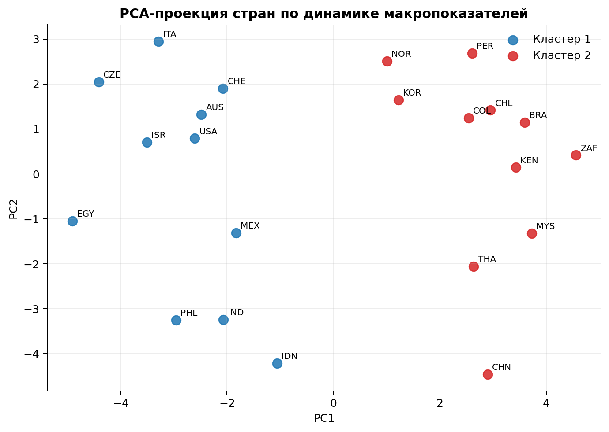

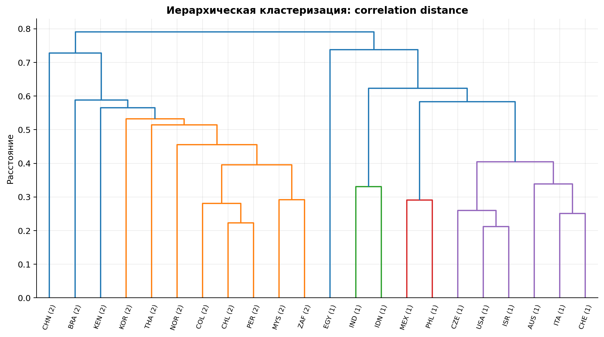

K-means дает компактные группы вокруг центроидов и удобен для выбора типичного представителя. Иерархическая кластеризация лучше показывает структуру вложенных расстояний и близость отдельных стран. Основные группы в обоих подходах близки по смыслу, но отдельные страны с нестандартной инфляцией или процентной ставкой могут переходить между соседними группами.

### 10.5. Визуализация и интерпретация кластеров

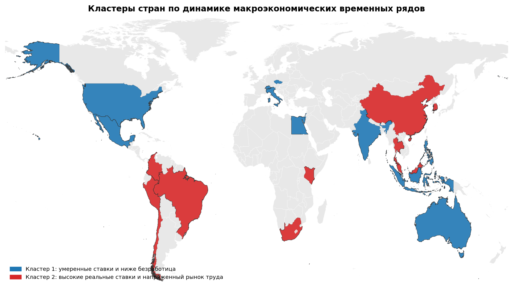

| Кластер                                                      | N      | Типичные страны                                       | Регионы                         | Средний рост ВВП | Средняя безработица | Средняя инфляция | Средняя реальная ставка |
| ------------------------------------------------------------ | ------ | ----------------------------------------------------- | ------------------------------- | ---------------- | ------------------- | ---------------- | ----------------------- |
| Кластер 1: умеренные ставки и ниже безработица               | 11.000 | США, Израиль, Швейцария, Чехия, Италия, Австралия     | Европа, Азия, Северная Америка  | 3.220            | 5.818               | 4.024            | 2.563                   |
| Кластер 2: высокие реальные ставки и напряженный рынок труда | 11.000 | Перу, Колумбия, Малайзия, ЮАР, Чили, Республика Корея | Латинская Америка, Азия, Африка | 3.309            | 7.231               | 3.729            | 6.559                   |

Полная таблица стран и кластеров сохранена: `microqualification/tables/country_cluster_assignments.csv`.

| ISO3 | Страна           | Регион                | k-means кластер                                              | Иерарх. кластер | Расст. до центроида | Представитель |
| ---- | ---------------- | --------------------- | ------------------------------------------------------------ | --------------- | ------------------- | ------------- |
| USA  | США              | Северная Америка      | Кластер 1: умеренные ставки и ниже безработица               | 2.000           | 4.254               | да            |
| ISR  | Израиль          | Ближний Восток        | Кластер 1: умеренные ставки и ниже безработица               | 2.000           | 4.410               |               |
| CHE  | Швейцария        | Европа                | Кластер 1: умеренные ставки и ниже безработица               | 2.000           | 4.445               |               |
| CZE  | Чехия            | Европа                | Кластер 1: умеренные ставки и ниже безработица               | 2.000           | 4.767               |               |
| ITA  | Италия           | Европа                | Кластер 1: умеренные ставки и ниже безработица               | 2.000           | 4.871               |               |
| AUS  | Австралия        | Океания               | Кластер 1: умеренные ставки и ниже безработица               | 2.000           | 5.042               |               |
| MEX  | Мексика          | Латинская Америка     | Кластер 1: умеренные ставки и ниже безработица               | 2.000           | 5.530               |               |
| PHL  | Филиппины        | Азия                  | Кластер 1: умеренные ставки и ниже безработица               | 2.000           | 5.609               |               |
| IND  | Индия            | Азия                  | Кластер 1: умеренные ставки и ниже безработица               | 2.000           | 5.647               |               |
| IDN  | Индонезия        | Азия                  | Кластер 1: умеренные ставки и ниже безработица               | 2.000           | 6.170               |               |
| EGY  | Египет           | Ближний Восток/Африка | Кластер 1: умеренные ставки и ниже безработица               | 2.000           | 6.866               |               |
| PER  | Перу             | Латинская Америка     | Кластер 2: высокие реальные ставки и напряженный рынок труда | 1.000           | 3.970               | да            |
| COL  | Колумбия         | Латинская Америка     | Кластер 2: высокие реальные ставки и напряженный рынок труда | 1.000           | 4.100               |               |
| MYS  | Малайзия         | Азия                  | Кластер 2: высокие реальные ставки и напряженный рынок труда | 1.000           | 4.245               |               |
| ZAF  | ЮАР              | Африка                | Кластер 2: высокие реальные ставки и напряженный рынок труда | 1.000           | 4.572               |               |
| CHL  | Чили             | Латинская Америка     | Кластер 2: высокие реальные ставки и напряженный рынок труда | 1.000           | 5.011               |               |
| KOR  | Республика Корея | Азия                  | Кластер 2: высокие реальные ставки и напряженный рынок труда | 1.000           | 5.486               |               |
| NOR  | Норвегия         | Европа                | Кластер 2: высокие реальные ставки и напряженный рынок труда | 1.000           | 5.521               |               |
| THA  | Таиланд          | Азия                  | Кластер 2: высокие реальные ставки и напряженный рынок труда | 1.000           | 5.536               |               |
| KEN  | Кения            | Африка                | Кластер 2: высокие реальные ставки и напряженный рынок труда | 1.000           | 5.605               |               |
| BRA  | Бразилия         | Латинская Америка     | Кластер 2: высокие реальные ставки и напряженный рынок труда | 1.000           | 5.982               |               |
| CHN  | Китай            | Азия                  | Кластер 2: высокие реальные ставки и напряженный рынок труда | 1.000           | 6.833               |               |

Названия кластеров даны по средним характеристикам: росту ВВП, безработице, инфляции и реальной ставке. Внутри кластеров важны не только средние уровни, но и синхронность реакции на шоки 2020–2022 гг.

### 10.6. Типичный представитель кластера

В качестве типичного представителя выбран Перу (PER) из группы `Кластер 2: высокие реальные ставки и напряженный рынок труда`. Страна выбрана как ближайшая к центроиду своего k-means кластера.

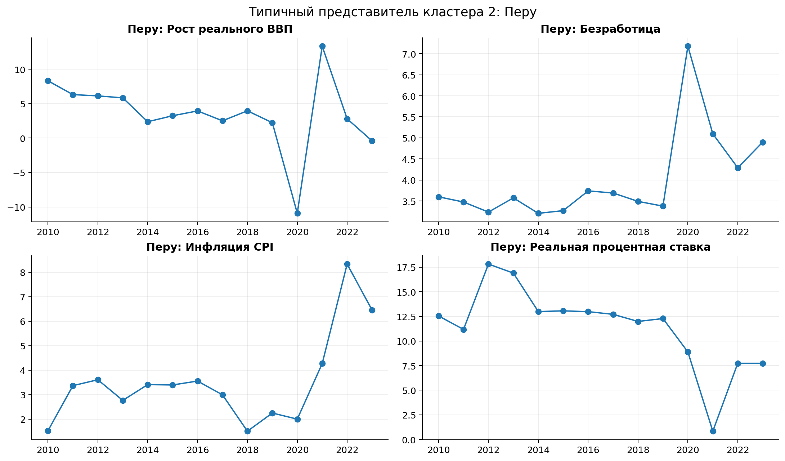

Для представителя проведен краткий аналог анализа из разделов 1–8. На годовых данных оценена ADL-модель:

$$\Delta u_t = \alpha + \beta g_t + \phi\Delta u_{t-1} + \gamma\pi_t + \varepsilon_t.$$

Коэффициент при росте ВВП равен -0.227. Отрицательный знак означает, что более высокий рост выпуска связан со снижением прироста безработицы, то есть вывод по знаку согласуется с законом Оукена. Из-за короткого годового ряда результаты рассматриваются как диагностические, а не как строгая структурная оценка.

| Параметр          | coef   | std err HAC | t      | p-value |
| ----------------- | ------ | ----------- | ------ | ------- |
| const             | 1.263  | 0.296       | 4.270  | 0.000   |
| gdp_growth        | -0.227 | 0.032       | -7.165 | 0.000   |
| d_unemployment_L1 | 0.055  | 0.115       | 0.481  | 0.631   |
| inflation         | -0.130 | 0.070       | -1.866 | 0.062   |

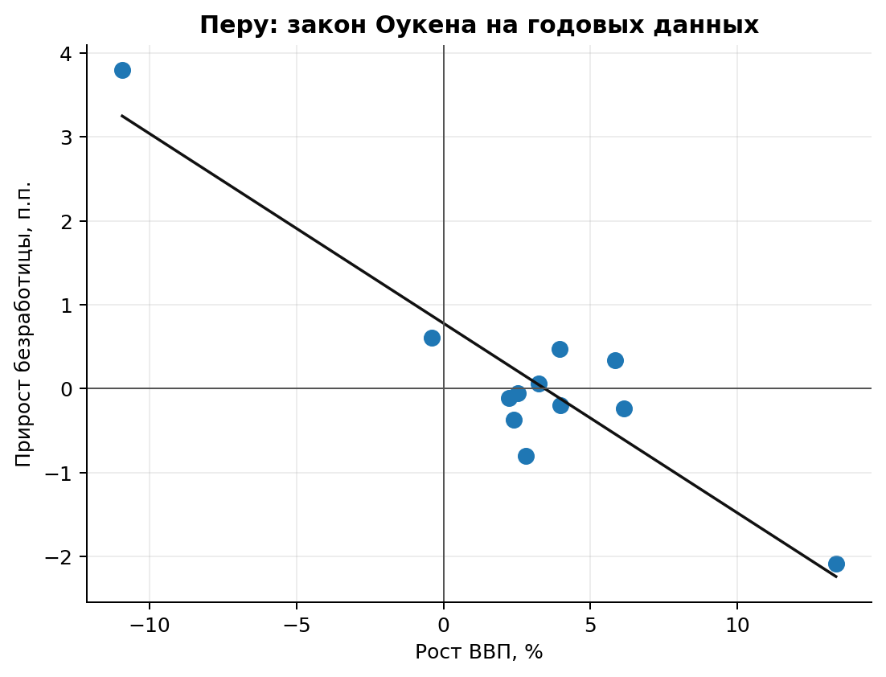

Стационарность для годовых преобразованных рядов проверена кратко:

| Ряд             | ADF stat | ADF p  | Краткий вывод                |
| --------------- | -------- | ------ | ---------------------------- |
| gdp_growth      | -3.386   | 0.011  | есть признаки стационарности |
| d_unemployment  | 1.085    | 0.995  | вывод осторожный             |
| inflation       | -4.509   | <0.001 | есть признаки стационарности |
| d_real_interest | -4.256   | <0.001 | есть признаки стационарности |

VAR(1) для представителя:

| Модель         | AIC   | BIC   | Устойчива | Комментарий                                          |
| -------------- | ----- | ----- | --------- | ---------------------------------------------------- |
| VAR(1), annual | 4.653 | 5.461 | да        | короткая годовая выборка, результаты диагностические |

p-value теста причинности по Грейнджеру `рост ВВП → прирост безработицы` для представителя: 0.163.

### 10.7. Сравнение с результатами разделов 1–8

Для США в основной части отчета коэффициент Оукена в ADL равен примерно -0.106. Для типичного представителя выбранного кластера коэффициент равен -0.227. В обоих случаях знак отрицательный, то есть экономическая интерпретация совпадает: ускорение выпуска связано с улучшением ситуации на рынке труда. Различие состоит в частоте и составе данных: для США использованы квартальные ряды FRED и более длинная выборка, а для международного сравнения — годовые ряды World Bank и более короткий период 2010–2023.

Кластеризация показывает, что США не следует автоматически переносить на все страны как универсальный шаблон. Страны с похожей динамикой могут иметь разный уровень безработицы или инфляции, но похожую реакцию траекторий на шоки. Поэтому для международного прогноза важнее сравнивать не только уровни, но и форму временных рядов.

### 10.8. Вывод аналитика международной экономической организации

С практической точки зрения страны можно разделить на несколько групп с похожей макродинамикой. Для прогнозирования внешних шоков это означает, что реакцию страны разумно сравнивать прежде всего с ее кластером, а не со всей мировой выборкой. Кластеры с высокой инфляцией и ставками требуют отдельного мониторинга денежно-кредитных условий; кластеры с высоким ростом и низкой безработицей более устойчивы к умеренным шокам спроса; группы со слабым ростом и напряженным рынком труда более уязвимы к отрицательным внешним шокам.

Главный методический вывод: динамическая кластеризация дополняет VAR/ADL-анализ. Модели взаимосвязей показывают, как показатели связаны внутри одной страны, а кластеризация показывает, какие страны имеют сходную траекторию и могут быть использованы как сравнительная группа для прогноза.

## Приложение A. Файлы расчетов

* Данные уровней: `data/fred_quarterly_us_macro_1990_2026.csv`
* Стационарные преобразования: `data/fred_transformed_stationary_series.csv`
* Таблицы расчетов: `tables/*.csv` и `tables/*.md`
* Графики: `figures/*.png`
* Скрипт генерации основной части: `../scripts/build_time_series_report.py`
* Скрипт микроквалификации: `../scripts/build_microqualification_clustering.py`
* Скрипт VECM/ECM и расчетных приложений: `../scripts/add_assignment_compliance_extensions.py`

Фрагмент исходной таблицы уровней:

| quarter | GDPC1      | UNRATE | CPIAUCSL | FEDFUNDS |
|---------|------------|--------|----------|----------|
| 1990Q1  | 10 047.386 | 5.300  | 128.033  | 8.250    |
| 1990Q2  | 10 083.855 | 5.333  | 129.300  | 8.243    |
| 1990Q3  | 10 090.569 | 5.700  | 131.533  | 8.160    |
| 1990Q4  | 9 998.704  | 6.133  | 133.767  | 7.743    |
| 1991Q1  | 9 951.916  | 6.600  | 134.767  | 6.427    |
| 2025Q1  | 23 548.210 | 4.133  | 319.475  | 4.330    |
| 2025Q2  | 23 770.976 | 4.200  | 320.786  | 4.330    |
| 2025Q3  | 24 026.834 | 4.333  | 323.235  | 4.293    |
| 2025Q4  | 24 055.749 | 4.450  | 325.547  | 3.897    |
| 2026Q1  | 24 152.656 | 4.333  | 328.114  | 3.640    |

## Приложение C. Расчетные приложения Python

В PDF-задании требуется привести скрины расчетов из статистического пакета. В этой версии отчета расчеты выполнены воспроизводимым Python-кодом, поэтому в приложение добавлены PNG-таблицы с ключевыми результатами. Полные форматированные таблицы также сохранены в CSV/MD-файлах.

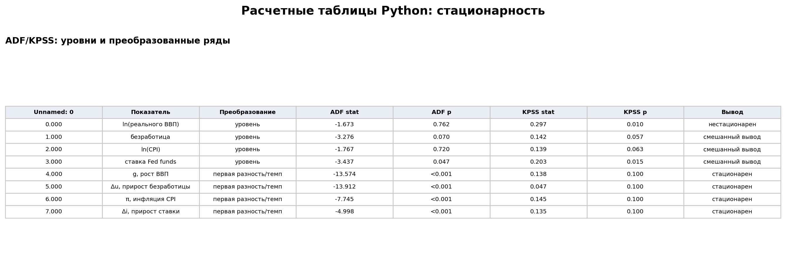

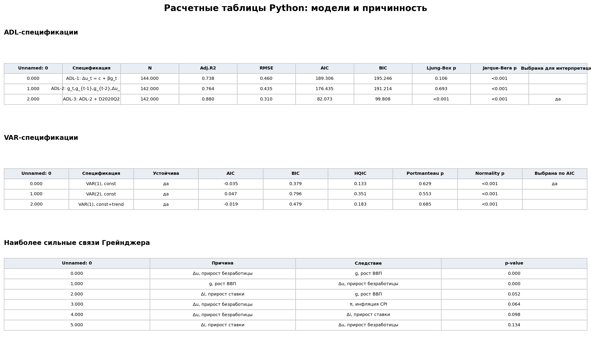

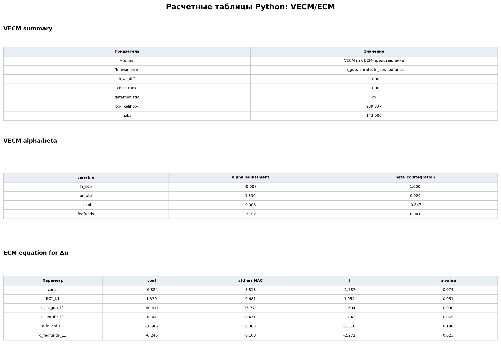

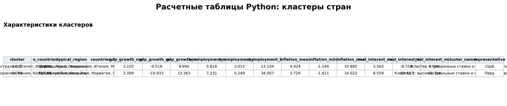

Код расчетов:

- `../scripts/build_time_series_report.py` — основная часть 1–8;
- `../scripts/build_microqualification_clustering.py` — микроквалификация;
- `../scripts/add_assignment_compliance_extensions.py` — VECM/ECM-дополнение и расчетные PNG-приложения.

## Приложение B. Список литературы и источники

* Knotek, E. S. II (2007). *How useful is Okun's law?* Economic Review, Federal Reserve Bank of Kansas City, 92(Q IV), 73-103. https://www.kansascityfed.org/documents/955/2007-How%20Useful%20is%20Okun%27s%20Law%3F.pdf
* FRED: Real Gross Domestic Product [GDPC1]. https://fred.stlouisfed.org/series/GDPC1
* FRED: Unemployment Rate [UNRATE]. https://fred.stlouisfed.org/series/UNRATE
* FRED: Consumer Price Index for All Urban Consumers [CPIAUCSL]. https://fred.stlouisfed.org/series/CPIAUCSL
* FRED: Federal Funds Effective Rate [FEDFUNDS]. https://fred.stlouisfed.org/series/FEDFUNDS
